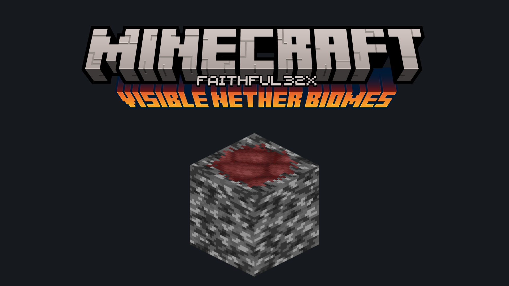
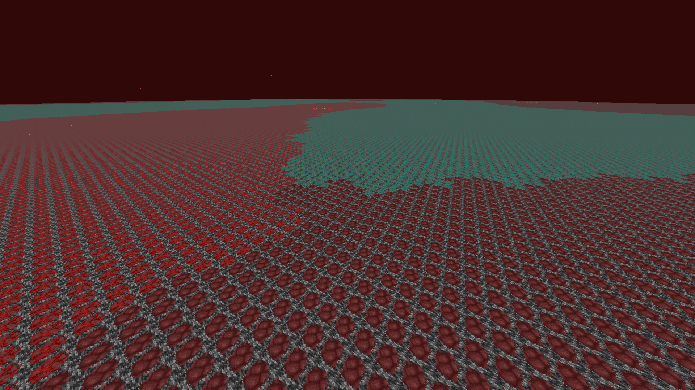
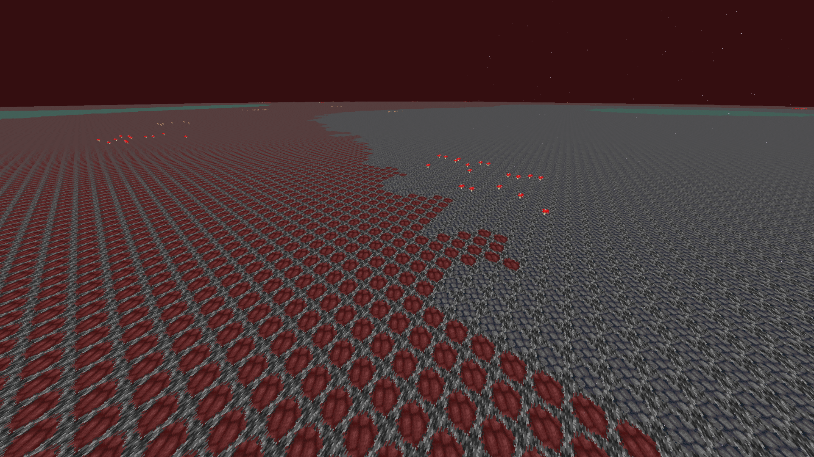
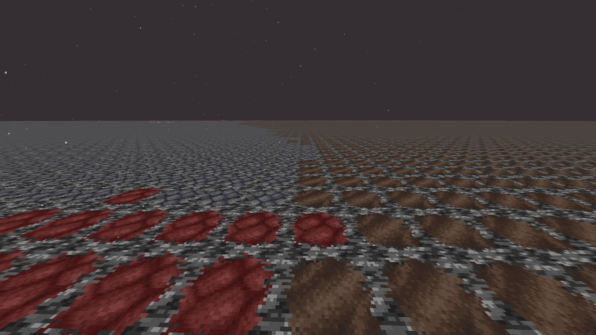
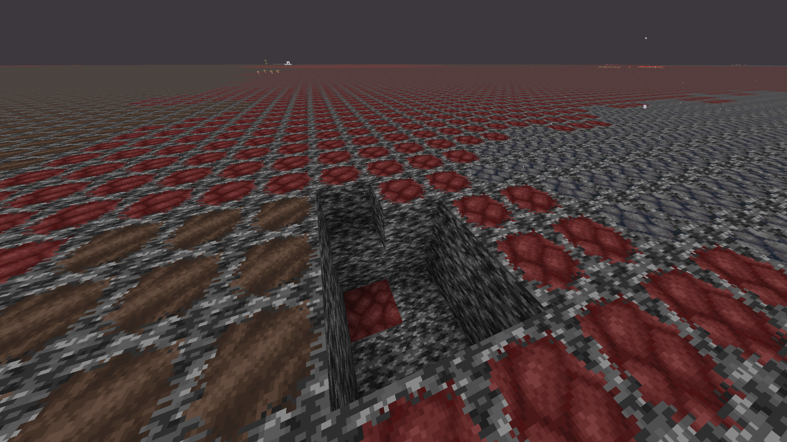

Changes the bedrock to a biome-specific texture in the nether roof (Y=128). By using this pack, you can visualize the boundaries of biomes. So you don't have to open that confusing F3 menu anymore! This is an upscaled version of Visible Nether Biomes by voxelity.

